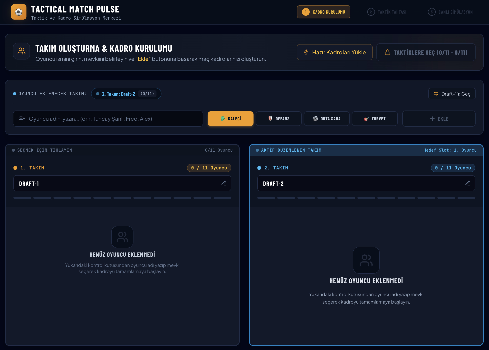
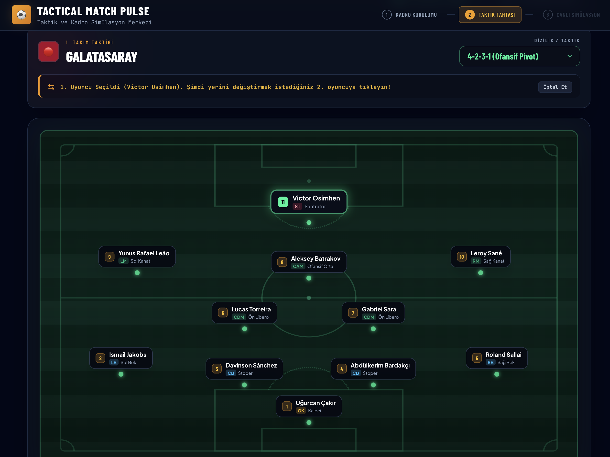
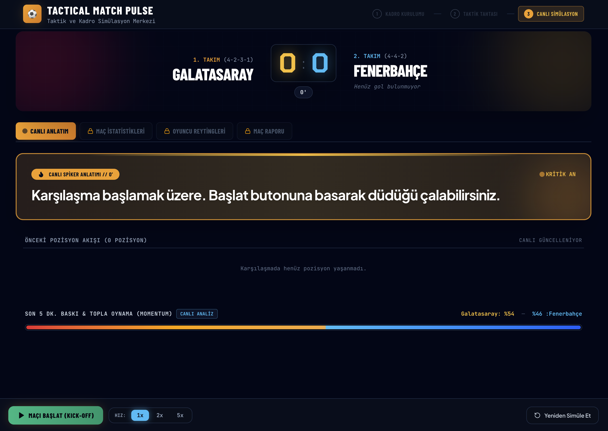

# ⚽ Tactical Match Pulse - AI Football Engine & Simulator


> **Yapay Zekâ Destekli Canlı Türkçe Maç Simülatörü ve Taktik Motoru**  
> `gpt-5.4-mini` altyapısı ile iki futbol takımı arasındaki mücadeleyi efsaneleşmiş Türkçe spiker anlatımları (Yalçın Çetin & Ercan Taner tarzı), dinamik pozisyon çeşitliliği ve gerçekçi taktik/mevki analizleriyle 90 dakika boyunca canlı olarak simüle eder.

---

## 🌟 Öne Çıkan Özellikler

- 🤖 **GPT-5.4-Mini Maç Motoru:** Oyuncuların gerçek dünyadaki kalitesini, yeteneklerini ve performans dönemlerini yapay zeka dinamik olarak değerlendirir.
- 🎙️ **Türkçe Maç Spikeri Anlatımı:** Her pozisyonda 4 ila 8 cümleden oluşan heyecanlı, akıcı ve adım adım spiker anlatımları.
- ⚡ **Gerçekçi Mevki ve Kalite Analizi:** 
  - Kalede forvet veya mevkisi dışında oynatılan oyuncular için otomatik performans cezası (Out-of-Position Penalty).
  - Kadro uçurumlarında ezici ve tarihi skorlar (7-0, 9-1, 10-0 vb.).
- 📐 **Esnek Taktik Tahtası:** 4-4-2, 4-3-3, 3-5-2, 4-2-3-1, 5-3-2 gibi popüler formasyonlar ve oyuncuların saha üzerindeki yerlerini tıklayarak veya sürükleyerek değiştirme imkanı.
- 🕹️ **Retro CM 01/02 Tarzı Canlı Yayın:** Hız kontrolü (1x, 2x, 5x, 10x), anında bitirme, canlı skor ve detaylı maç istatistikleri.

---

## 📖 Adım Adım Kullanım Rehberi

### 1️⃣ Ekran: Takım Oluşturma & Kadro Kurulumu (Draft Screen)

Bu ekranda maçta karşı karşıya gelecek iki takımı ve 11'lerini hazırlarsınız.

> [!TIP]
> 💡 **Gözden Kaçmasın - Takım İsimlerini Değiştirme:**  
> Takım kartlarının üzerindeki varsayılan **"Draft-1"** ve **"Draft-2"** metinlerinin yanındaki düzenleme (düzenle/kalem) simgesine tıklayarak takımlarınıza dilediğiniz ismi verebilirsiniz (Örn: *Dünya Karması*, *Eyüpspor*, *Prime Real Madrid*).

1. **Oyuncu Ekleme:** Oyuncu adı alanına dilediğiniz futbolcunun adını yazın (örn: *Arda Güler*, *Florian Wirtz*, *Fernando Muslera*).
2. **Mevki Seçimi:** Oyuncunun sahadaki pozisyonunu (GK, CB, LB, RB, CDM, CM, CAM, LW, RW, ST) seçin ve **Kadroya Ekle** butonuna basın.
3. **Sırayla Ekleme:** Oyuncu eklendiğinde sıra otomatik olarak diğer takıma geçer. Her iki takım için 11 oyuncu tamamlanmalıdır.
4. **Hızlı Doldur (Auto-Fill):** İsterseniz tek tıkla varsayılan hazır kadroları (Galatasaray vs Fenerbahçe) yükleyerek hızlıca teste geçebilirsiniz.

---

### 2️⃣ Ekran: Taktik Tahtası & Mevki Değişimi (Tactics Board)

Takımlar oluşturulduktan sonra 11'lerin saha dizilişlerini ve taktiklerini ayarlayabilirsiniz.

1. **Formasyon Seçimi:** Her takım için 4-4-2, 4-3-3, 4-2-3-1, 3-5-2, 5-3-2 vb. taktiksel dizilişlerden birini seçin.
2. **Yer / Mevki Değiştirme (Swap):**  
   - Saha üzerindeki veya kadro listesindeki bir oyuncunun üzerine tıklayın.
   - Ardından değiştirmek istediğiniz diğer oyuncunun üzerine tıklayın.
   - **Taktik Denemeler:** Örneğin kalecinizi santraforla değiştirip bir forveti kaleye koyabilir, yapay zekanın bu mevki zafiyetini nasıl cezalandırdığını (farklı skorlar) canlı görebilirsiniz!

---

### 3️⃣ Ekran: Canlı Maç Simülasyonu & Spiker Anlatımı (Match Engine)

Taktikleri onaylayıp **"Maçı Başlat"** butonuna bastığınızda `gpt-5.4-mini` devreye girer.

1. **AI Simülasyon Yükleyici:** Yapay zeka 90 dakikalık maçı, 20-40 arası dinamik pozisyonu ve spiker metinlerini hazırlar.
2. **Canlı Anlatım:** Maç CM 01/02 stili spiker ekranında dakika dakika akar.
3. **Pozisyon Çeşitliliği:** Kornerler, frikik golleri, sarı/kırmızı kartlar, ofsayt kararları, 90'a giden şutlar ve harika kurtarışlar gösterilir.
4. **Maç Kontrolleri:**  
   - ⏯️ **Oynat / Duraklat**  
   - ⏩ **Simülasyon Hızı:** 1x, 2x, 5x, 10x  
   - ⚡ **Anında Bitir:** Maçı direkt 90. dakikaya sıçratarak sonuç raporunu görüntüler.  
   - 📊 **Detaylı İstatistikler & Oyuncu Puanları:** Maç sonu topla oynama, şut, xG, pas isabeti ve oyuncu reytingleri gösterilir.

---

## 🛠️ Kurulum ve Çalıştırma

### Gereksinimler
- Node.js (v18 veya üzeri)
- npm veya yarn
- OpenAI API Key (`gpt-5.4-mini` erişimi olan)

### Adımlar

1. **Projeyi Klonlayın veya İndirin:**
   ```bash
   git clone https://github.com/selimhamzaogullari/match-simulator.git
   cd match-simulator
   ```

2. **Bağımlılıkları Yükleyin:**
   ```bash
   npm install
   ```

3. **Environment Dosyasını Oluşturun:**
   Proje kök dizininde bir `.env` dosyası oluşturun ve OpenAI API anahtarınızı ekleyin:
   ```env
   VITE_OPENAI_API_KEY=your_openai_api_key_here
   VITE_OPENAI_MODEL=gpt-5.4-mini
   ```

4. **Geliştirme Sunucusunu Başlatın:**
   ```bash
   npm run dev
   ```
   Tarayıcınızda `http://localhost:5173` adresini açarak simülatörü kullanmaya başlayabilirsiniz!

5. **Production Build:**
   ```bash
   npm run build
   ```

---

## 📸 Ekran Görüntüleri

*(Projenize ekran görüntüleri eklediğinizde aşağıdaki alanları güncelleyebilirsiniz)*

| 1. Kadro Kurulumu (Draft) | 2. Taktik Tahtası (Tactics) | 3. Canlı Spiker Anlatımı |
| :---: | :---: | :---: |
|  |  |  |

---

## 🏗️ Proje Mimarisi

```text
src/
├── components/
│   ├── AiSimulatingLoader.jsx   # AI Simülasyon yükleme ekranı
│   ├── Cm0102MatchView.jsx      # Canlı maç spikeri ve maç ekranı
│   ├── DraftPickScreen.jsx      # 1. Ekran: Takım ismi değiştirme & Oyuncu ekleme
│   ├── MatchReport.jsx          # Maç sonu genel raporu
│   ├── MatchStats.jsx           # Maç içi topla oynama/şut/xG istatistikleri
│   ├── PlayerRatings.jsx        # Oyuncu maç sonu reytingleri
│   ├── Scoreboard.jsx           # Canlı skor tabelası ve zamanlayıcı
│   ├── SquadSetupWizard.jsx     # 2. Ekran: Taktik ve saha içi mevki değiştirme
│   └── TacticalPitchBoard.jsx   # İnteraktif 2D saha ve oyuncu sürükleme/tıklama
├── data/
│   └── teams.js                 # Varsayılan takımlar & Formasyon diziliş koordinatları
├── engine/
│   └── matchEngine.js           # API anahtarı olmadığında çalışan fallback yerel simülatör
├── services/
│   └── openaiMatchService.js    # GPT-5.4-Mini ChatGPT API Maç Motoru & Prompt Yapısı
├── App.jsx                      # Ana uygulama akış yönetimi
└── main.jsx                     # Vite React giriş noktası
```

---

## 📄 Lisans
Bu proje MIT lisansı ile lisanslanmıştır.
